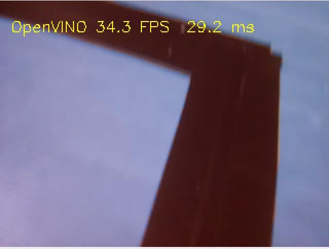
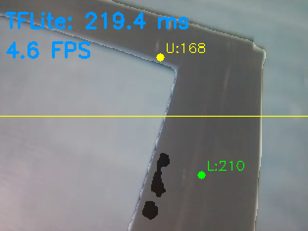

# Vision-Based Line-Following Car 🚗⚡

Real-time autonomous Raspberry Pi car using **YOLOv8 Segmentation (TFLite / OpenVINO)** and classical **OpenCV** vision.
Supports smooth steering, angle detection for 90° turns, telemetry logging, and modular detector backend.

---

## 🌟 Key Features

### 🔎 **1. YOLO-Based Segmentation**

Supports two segmentation backends:

* **OpenVINO (recommended):** 2.5× faster than TFLite
* **TFLite:** portable, works without dependencies

### 🎥 **2. Line Detection & ROI System**

* Upper / lower ROI split
* Centroid detection
* ROI bins (left/center/right)
* Pixel mass weighted center

### 🧭 **3. Angle Detection**

* Detects 90° turns
* Detects sharp turns
* Uses region-based heuristics + temporal smoothing

### ⚙️ **4. Steering Controller**

* PID-like correction
* Speed modulation near turns
* Smooth maneuvering state machine

### 📊 **5. Telemetry & Debugging**

* CSV logs of speeds, states, ROI values
* Optional overlay with line mask, centers, ROI grid
* Debug display mode

---

# 🗂 Project Structure

```bash
Vision-Based-Line-Following-Car/
├── checkpoints/                    # YOLO models (TFLite, ONNX, OpenVINO)
├── data/
├── demo/                           
│   ├── openvino_result.jpg
│   ├── tflite_result.jpg
│   ├── driving_demo.gif
│   └── mask_overlay_example.png
├── src/
│   ├── YoloLineDetector.py         # YOLOv8-seg → mask → binary output
│   ├── line_detector.py            # Classical OpenCV detector
│   ├── angle_analyzer.py
│   ├── controller.py               # Vision + steering main logic
│   ├── motor_controller.py
│   ├── camera_module.py
│   ├── main.py                     # Full system runtime
│   └── convertation/               # Model export tools
│       ├── check_openvino.py
│       ├── tf_check.py
│       ├── yoloPth2Tflite.py
│       └── openvino_convertation.py
│
└── README.md
```

---

# ⚡ Segmentation Backends: OpenVINO vs TFLite

We support two YOLOv8-seg model formats:

| Backend            | Time per frame | FPS          | Notes                              |
| ------------------ | -------------- | ------------ | ---------------------------------- |
| **TFLite Float16** | **124.17 ms**  | **8.1 FPS**  | Slow postprocess, good portability |
| **OpenVINO FP16**  | **46.14 ms**   | **21.7 FPS** | ⚡ FASTEST, recommended             |

To convert pth to tflite, find a guide here: src/convertation/steps.md
One script is used to convert openvino: src/convertation/openvino_convertation.py

### ✔ Why OpenVINO is faster?

* Optimized linear algebra
* Batch-friendly GEMM kernels
* Fast sigmoid/mask reconstruction
* Multithreading even on CPU
* Efficient FP16 support

**Conclusion: use OpenVINO for real robot driving**

---

# 📸 Demo Results (demo/)


```
demo/
├── openvino_result.jpg       # mask overlay from OpenVINO
├── tflite_result.jpg         # mask overlay from TFLite
├── driving_demo.gif          # optional driving animation
└── mask_overlay_example.png
```

---

### 🖼 OpenVINO Output Example



### 🖼 TFLite Output Example



---

# ▶️ Run the System

### Use YOLOv8 Segmentation (default)

```bash
python3 src/main.py
```
Change the opencv mode in the src/controller.py

